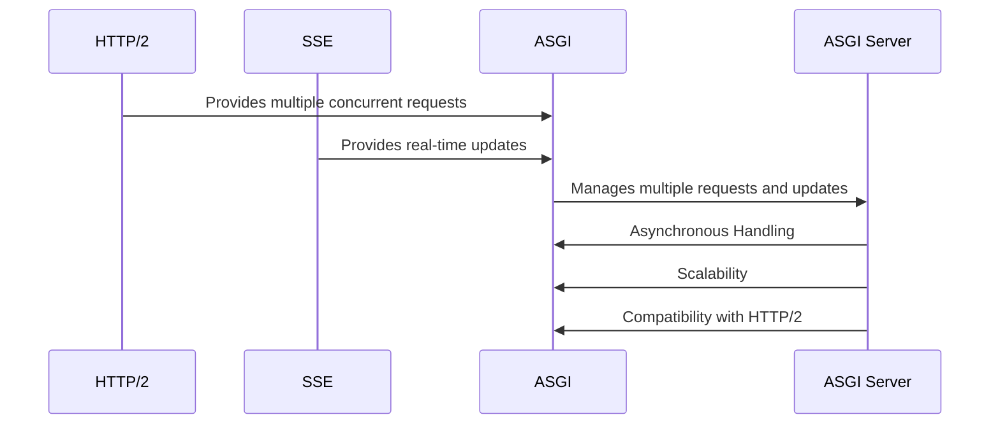
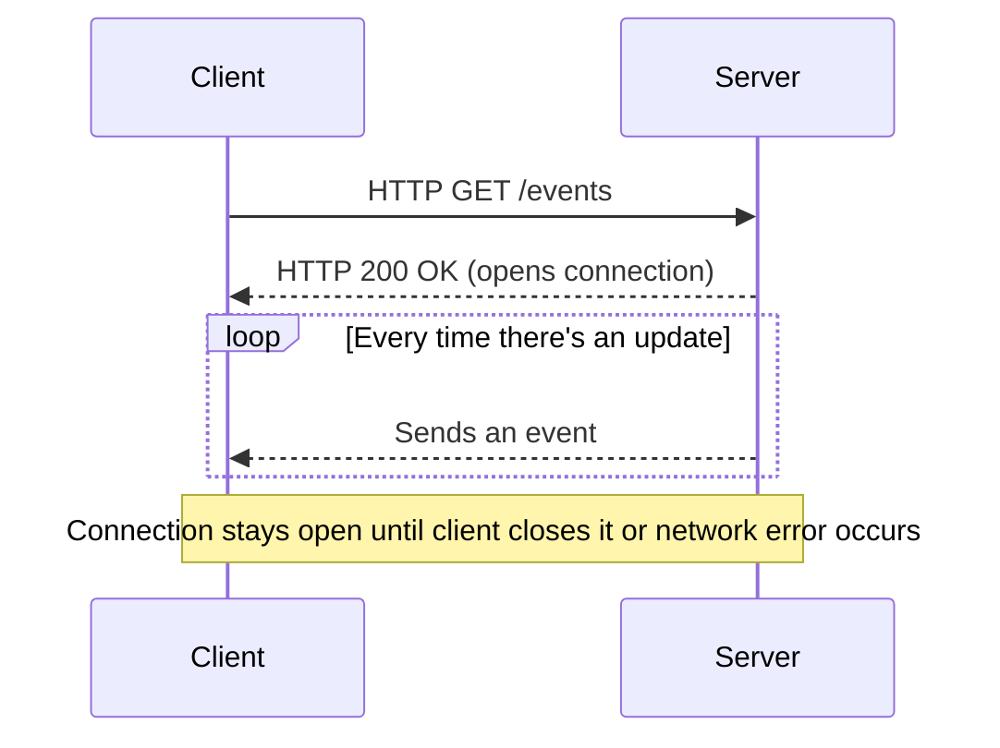

# Introduction to Real-Time Data Visualizations

# What are Real-Time Data Visualizations?

Real-time data visualizations update data representations immediately as new information becomes available,
providing live insights and feedback essential for decision-making.

## Key Benefits

- **Immediate Insights**: Quickly identify trends and make informed decisions.
- **Enhanced User Engagement**: Interactive visuals improve user experience.
- **Operational Efficiency**: Streamline processes with up-to-date information.
- **Predictive Analytics**: Combine real-time data with machine learning for forecasts.

## Data Pipelines

The data pipeline is the overall process of how data flows from its source to the visualization. It involves several
stages, each of which plays a crucial role in preparing the data for visualization.

* **Data Collection**: This is the first stage of the pipeline, where data is gathered from various sources. These
  sources could be sensors that monitor specific parameters, APIs that provide access to data from other applications,
  or databases that store large amounts of data. The key here is to ensure that the data is collected in a way that is
  reliable and efficient.
* **Data Processing**: Once the data is collected, it needs to be processed. This could involve cleaning the data to
  remove any errors or inconsistencies, transforming the data into a suitable format for analysis, or aggregating the
  data to make it easier to work with. Tools like Apache Kafka and Apache Flink are often used for this stage, as they
  can handle large volumes of data and provide real-time processing capabilities.
* **Data Storage**: After processing, the data is stored in a database or other storage system. This allows the data to
  be easily accessed and retrieved when needed. Redis is a popular choice for this stage, as it offers high-performance
  data storage and retrieval.
* **Data Visualization**: The final stage of the pipeline is data visualization. This involves presenting the data in a
  visual format that makes it easy to understand and interpret. Tools like Bokeh, Plotly, and Dash are often used for
  this stage, as they provide a wide range of visualization options and can handle real-time data. The visualizations
  can be interactive, allowing users to explore the data and gain deeper insights.

## Use Case: Monitoring Electrical Grid

**Role**: System Operator

**Responsibilities**:

- Overseeing day-to-day operations of an electrical grid.
- Ensuring reliable and efficient delivery of electricity from power plants to consumers.
- Monitoring grid performance.
- Balancing supply and demand.
- Responding to outages or emergencies.
- Coordinating maintenance activities.

**Tools and Technologies**: Advanced tools and real-time data systems.

**Key Activities**:

1. **Monitoring Grid Performance**: Tracks real-time data such as power generation, load demand, frequency, and voltage
   levels.
2. **Balancing Supply and Demand**: Adjusts power generation and distribution based on real-time demand data.
3. **Responding to Outages or Emergencies**: Takes immediate action to mitigate issues and restore normal operations.
4. **Coordinating Maintenance Activities**: Schedules maintenance work, inspects equipment, and implements preventive
   measures.
5. **Supporting Renewable Energy Integration**: Manages renewable energy resources by monitoring production, integrating
   into the grid, and adjusting operations.

## Use Case: Real-Time Energy Data Visualization

Real-time displays serve the System Operator in various ways, enhancing their ability to manage the electrical grid
effectively:

1. **Real-Time Monitoring**: Instantly access grid metrics for immediate adjustments.
2. **Anomaly Detection**: Identify and respond to grid irregularities quickly.
3. **Data Visualization**: Make informed decisions and optimize grid performance.
4. **Supply and Demand Balancing**: Visualize real-time data to maintain balance and reduce outages.
5. **Proactive Maintenance**: Anticipate and promptly address maintenance needs.
6. **Energy Sustainability**: Manage resources efficiently and minimize waste.
7. **Operational Efficiency**: Streamline operations and reduce costs.
8. **Enhanced Stability**: Maintain continuous power delivery and grid resilience.

## Python

Python is a high-level, interpreted programming language with dynamic semantics. It's built-in data structures, combined
with dynamic typing and dynamic binding, make it an ideal language for scripting and rapid application development.
Python supports modules and packages, encouraging program modularity and code reuse.

Python is particularly well-suited for data visualization for several reasons:

1. **Accessible Syntax**: Python's clear and intuitive syntax makes it easy to learn, read, and write. This
   accessibility
   extends to its data visualization libraries, which are designed to be user-friendly and straightforward.

2. **Extensive Libraries**: Python has a rich ecosystem of libraries, including several powerful options for data
   visualization like Matplotlib, Seaborn, Plotly, and Bokeh. These libraries offer a wide range of features and
   customization options, allowing you to create high-quality, interactive visualizations.

3. **Community Support**: Python has a large and active community, which means you can find a wealth of resources,
   tutorials, and code snippets to help you with your data visualization tasks. If you encounter a problem or need help,
   chances are someone else has already faced the same issue and you can find help and solutions online.

4. **Data Science Support**: Python is a popular language in the data science community. Libraries like NumPy, Pandas,
   and
   SciPy provide robust support for tasks like data cleaning, analysis, and transformation, which are often necessary
   steps before data can be visualized.

Sure, here is the documentation for the highlighted section:

### Python Generators

Python generators are a simple way of creating iterators. They are a special type of function that return an iterable
set of items, one at a time, in a special way. This is achieved by maintaining their state, so that they can resume
their execution from where they left off, allowing them to produce an infinite sequence of results, which makes them
highly useful for creating data streams for real-time visualizations.

When a generator function is called, it returns a generator object without even beginning execution of the function.
When `next()` method is called for the first time, the function starts executing until it reaches `yield` statement. The
yielded value is returned by the `next()` call.

Example of a simple generator function:

```python
def infinite_sequence():
    num = 0
    while True:
        yield num
        num += 1
```

### Non-Eager Behavior and Memory Efficiency

Generators are a great tool for working with large datasets because of their non-eager (lazy) evaluation. They generate
values on the fly and do not store them in memory, which means they can create a sequence of results over any range
without instantiating them all at once. This makes them highly memory efficient when dealing with large datasets.

### State Management in Generators

Another key difference is how they handle their internal state. In a list, the state is implicit in the index. You can
move the cursor around the list, go back to an earlier index, and so on. In a generator, the state is explicit in the
code. When you call next() on a generator, the code runs until it hits a yield statement, then it pauses and delivers
the yielded value. The next time you call next(), the generator resumes where it left off (it remembers all the data
values and which statement to execute next). This makes generators a powerful tool for state management in Python.

## Asyncio

Asyncio is a Python library that provides a framework for writing single-threaded concurrent code using coroutines,
multiplexing I/O access over sockets and other resources. It allows you to write code that performs high-level
asynchronous I/O operations, without needing to worry about thread management.

To use asyncio, you define coroutines using the `async` keyword. A coroutine is a special function that can give up
control to the caller without losing its state when awaiting a result from an asynchronous operation. This is done
through the `await` keyword.

Here are some examples using asyncio:

```python
import asyncio


# Define a coroutine

async def say_after(delay, what):
    await asyncio.sleep(delay)


print(what)


# Main coroutine that waits for other coroutines

async def main():
    print(f"started at {time.strftime('%X')}")


# Wait for two coroutines to complete
await say_after(1, 'hello')
await say_after(2, 'world')

print(f"finished at {time.strftime('%X')}")

# Running the main coroutine

asyncio.run(main())
```

## SQL Alchemy

- Explain benefits of using asynchronous sql queries when working with real-time data visualizations due to the blocking
  nature of synchronous queries.

```python
import asyncio
import threading

from sqlalchemy import create_engine, select
from sqlalchemy.ext.asyncio import create_async_engine, async_sessionmaker
from sqlalchemy.orm import sessionmaker

from database import EnergyDataTable, SessionLocal
from energy_dashboard.utils import ROOT_DIR

ASYNC_DATABASE_URL = f"sqlite+aiosqlite:///{ROOT_DIR}/energy.db"
DATABASE_URL = f"sqlite:///{ROOT_DIR}/energy.db"

engine = create_engine(DATABASE_URL, echo=True)

Session = sessionmaker(bind=engine)
session = SessionLocal()


def sync_main():
    # Fetch data synchronously
    sync_data = session.query(EnergyDataTable).where(EnergyDataTable.respondent == "MISO").order_by().limit(24).all()

    # Print the data all at once after it is fetched
    print("Synchronous Data:")
    for data in sync_data:
        print(f"Sync Msg: -> {data.period}")


async def fetch_data(async_session_local, order):
    result = await async_session_local().execute(select(EnergyDataTable)
                                                 .where(EnergyDataTable.respondent == "MISO")
                                                 .order_by()
                                                 .limit(24)
                                                 .offset(order * 24))
    async_data = result.scalars().all()

    # Return the data as a list
    return async_data


async def async_main():
    async_engine = create_async_engine(ASYNC_DATABASE_URL, echo=True)
    async_session_local = async_sessionmaker(
        autocommit=False, autoflush=False, bind=async_engine
    )

    # Fetch data asynchronously
    async with async_session_local.begin():
        # Fetch multiple data concurrently
        tasks = [fetch_data(async_session_local, order) for order in range(5)]
        for future in asyncio.as_completed(tasks):
            data = await future
            for item in data:
                print(f"Async Msg: => {item.period}")
                yield item


async def run_async_main():
    async for _ in async_main():
        pass


if __name__ == "__main__":
    # Start the synchronous function in a separate thread
    threading.Thread(target=sync_main).start()

    # Run the asynchronous main function in the main thread
    asyncio.run(run_async_main())

```

## ASGI vs WSGI

ASGI (Asynchronous Server Gateway Interface) and WSGI (Web Server Gateway Interface) are both specifications for web
servers to communicate with Python web applications. However, they are designed with different programming paradigms in
mind.

### WSGI

WSGI is a synchronous standard defined in PEP 333. It allows a web server to communicate with a Python web application.
It's a simple and traditional model where the application is called with an environment dictionary containing the
request information and a start_response function to initiate the response. Because WSGI is synchronous, it can handle
only one request at a time per process. This makes it suitable for applications with limited parallel processing needs.

### ASGI

ASGI is an asynchronous standard designed to support asynchronous Python features such as the `asyncio` library. ASGI
applications can handle multiple requests concurrently within a single process. This makes them more scalable and
performant for applications that manage many simultaneous connections or have a lot of wait time for I/O operations.

### Comparison

Here’s a brief comparison:

- **Concurrency:** ASGI can handle many concurrent connections, making it suitable for WebSockets, long-poll HTTP, and
  other long-lived connections.
- **Compatibility:** WSGI is an older standard and is supported by almost all Python web frameworks, whereas ASGI
  support is growing but not as ubiquitous.
- **Complexity:** ASGI applications can be more complex due to the asynchronous nature of the code.
- **Performance:** ASGI applications can be more efficient with resources, particularly with I/O-bound operations and
  when leveraging HTTP/2 or Server Sent Events (SSE).

### ASGI with HTTP/2 and SSE

HTTP/2 is a major revision of the HTTP network protocol that allows multiple concurrent requests over a single TCP
connection, known as multiplexing. This is a good match for ASGI's asynchronous capabilities, allowing ASGI to manage
these multiple requests concurrently without the overhead of creating multiple threads or processes.

Server Sent Events (SSE) are a standard allowing a server to push real-time updates to a client over an HTTP connection.
SSE requires the server to keep a connection open and send events when new updates are available.

ASGI is well-suited for SSE because:

- **Asynchronous Handling:** ASGI can efficiently manage the open connections typically used in SSE without keeping
  threads blocked, as the server only sends data to the client when an event is available.
- **Scalability:** With its ability to handle numerous connections in a single process, ASGI servers can support many
  clients simultaneously, sending updates to each client as needed.
- **Compatibility with HTTP/2:** Combining the multiplexing capabilities of HTTP/2 with ASGI makes it easier to handle
  multiple SSE streams over a single connection.

Thus, ASGI, when used with HTTP/2, becomes an excellent candidate for building applications with SSE because it offers a
performant and scalable way to handle real-time, server-initiated communications with clients.



In this diagram:

- HTTP/2 and SSE provide inputs to ASGI.
- ASGI then manages these inputs and provides them to the ASGI Server.
- The ASGI Server has three characteristics: Asynchronous Handling, Scalability, and Compatibility with HTTP/2.

## Server Sent Events (SSE)

#### Description

Server Sent Events (SSE) is a technology that allows a server to send real-time updates to a web page over a single
persistent HTTP connection. This is a technique used to build applications that need to update the client in real-time,
such as news feeds, social media updates, or live scores.

Here's a brief explanation suitable for a web newbie:

Normally, when you visit a webpage, your browser makes a request to a server, the server sends the requested page back,
and that's it. The connection is closed until you make another request (like clicking a link or refreshing the page).
However, sometimes you want to receive continuous updates from the server without needing to ask for them (polling) each
time. That's what SSE is for.

With SSE, the server keeps the connection open after sending the initial response and can then send new data whenever it
becomes available. This is extremely useful for delivering updates in real-time.

Illustration
Below is a text-based representation of a diagram showing the SSE flow from server to client, including payload shapes
with topic and data:



In this diagram:

- The client makes an HTTP GET request to the `/events` endpoint on the server.
- The server responds with a 200 OK status and opens a connection.
- Every time there's an update, the server sends an event to the client.
- The connection stays open until the client closes it or a network error occurs.

### Example Client-Side Code:

The following example shows how you might implement a simple web page that listens to SSE using JavaScript.

```html
<!DOCTYPE html>
<html>
<head>
    <title>Server Sent Events Example</title>
</head>
<body>
<h1>Real-time Updates</h1>
<div id="updates"></div>

<script>
    // Create a new EventSource instance that connects to the SSE endpoint
    const eventSource = new EventSource('/events');

    eventSource.onmessage = function (event) {
        // This function is called when a message is received
        const messageData = event.data;

        // Append the new data to the 'updates' div
        const updatesElement = document.getElementById('updates');
        updatesElement.innerHTML += messageData + '<br>';
    };

    eventSource.onerror = function (error) {
        // Handle any errors that occur
        console.log('EventSource failed: ', error);
    };

    // When you're done listening to events
    // eventSource.close();
</script>
</body>
</html>
```

### Example Server-Side Code (Node JS):

On the server side, you would have an endpoint that streams updates to the client using SSE.
The following example uses Node.js with the Express framework.

```js
const express = require('express');
const app = express();

app.get('/events', (req, res) => {
    // Headers to set up SSE
    res.writeHead(200, {
        'Content-Type': 'text/event-stream',
        'Cache-Control': 'no-cache',
        'Connection': 'keep-alive'
    });

    const sendEvent = (data) => {
        res.write(`data: ${JSON.stringify(data)}\n\n`); // Send the data to the client
    };

    // Send an update every second
    const intervalId = setInterval(() => {
        const message = {text: 'Hello World', timestamp: new Date()};
        sendEvent(message);
    }, 1000);

    // Close the connection when the client disconnects
    req.on('close', () => {
        clearInterval(intervalId);
    });
});

const PORT = 3000;
app.listen(PORT, () => {
    console.log(`Server is running on port ${PORT}`);
});
```

## FastAPI

FastAPI is a modern, fast (high-performance), web framework for building APIs with Python 3.6+ based on standard Python
type hints. It's built on top of Starlette for web routing and Pydantic for data validation.

Here's a brief documentation for the selected code:

```python
# Import FastAPI
from fastapi import FastAPI

# Initialize the FastAPI application
app = FastAPI()


# Define a route
@app.get("/")
def read_root():
    return {"Hello": "World"}

# Run the application
# Use uvicorn main:app --reload in the terminal where "main" is the name of this Python file and "app" is the FastAPI instance.
```

In the above code:

- `FastAPI` is the main class that you'll interact with. You create an instance of the `FastAPI` class, that will be
  your application.
- `@app.get("/")` is a decorator that tells FastAPI that the function below corresponds to the HTTP GET method at the
  path `/`.
- `def read_root():` defines a standard Python function that will be used by FastAPI to handle requests to the route
  mentioned above.
- `return {"Hello": "World"}` is the response that FastAPI will convert to JSON and return to the client.

FastAPI also automatically generates interactive API documentation for your application. You can access this
documentation by navigating to `/docs` path in your application (for example, `http://localhost:8000/docs` if you're
running your application locally).

The documentation is generated using the OpenAPI standard (formerly known as Swagger), and you can customize it with
additional information, descriptions, etc., by adding more metadata to your routes and data models.

## HTMX

HTMX is a powerful library that allows you to access AJAX, Server-Sent Events (SSE), WebSockets, and more directly in
HTML. It uses attributes like `hx-get`, `hx-post`, `hx-swap`, and `hx-trigger` to control the behavior of your HTML
elements.

Here's a brief overview of these attributes:

- `hx-get`: This attribute allows you to specify a URL that HTMX will `GET` when the element is triggered.

- `hx-post`: This attribute allows you to specify a URL that HTMX will `POST` to when the element is triggered.

- `hx-swap`: This attribute controls how the content fetched by `hx-get` or `hx-post` is swapped into the DOM.

- `hx-trigger`: This attribute controls what event triggers the action.

Here's an example of how you might use HTMX to create a button that fetches content from a server and updates a part of
the page without a full page reload:

```html

<button hx-get="/path/to/api" hx-trigger="click" hx-swap="outerHTML">
    Click me
</button>
```

In this example, when the button is clicked (`hx-trigger="click"`), HTMX will send a `GET` request
to `/path/to/api` (`hx-get="/path/to/api"`). The content returned by the server will then replace the button's outer
HTML (`hx-swap="outerHTML"`).

For Server-Sent Events (SSE), you can use the `hx-sse` attribute to connect to an SSE source. Here's an example:

```html

<div hx-sse="connect:/path/to/sse" hx-trigger="sse:customEvent" hx-swap="outerHTML">
    Waiting for updates...
</div>
```

In this example, the div will connect to the SSE source at `/path/to/sse` (`hx-sse="connect:/path/to/sse"`). When an
event named `customEvent` is received from the SSE source (`hx-trigger="sse:customEvent"`), the content of the event
will replace the div's outer HTML (`hx-swap="outerHTML"`).

Please note that the paths `/path/to/api` and `/path/to/sse` should be replaced with the actual paths to your API
endpoint and SSE source, respectively.

## Bokeh

HTMX is a powerful library that allows you to access AJAX, Server-Sent Events (SSE), WebSockets, and more directly in
HTML. It uses attributes like `hx-get`, `hx-post`, `hx-swap`, and `hx-trigger` to control the behavior of your HTML
elements.

Here's a brief overview of these attributes:

- `hx-get`: This attribute allows you to specify a URL that HTMX will `GET` when the element is triggered.

- `hx-post`: This attribute allows you to specify a URL that HTMX will `POST` to when the element is triggered.

- `hx-swap`: This attribute controls how the content fetched by `hx-get` or `hx-post` is swapped into the DOM.

- `hx-trigger`: This attribute controls what event triggers the action.

Here's an example of how you might use HTMX to create a button that fetches content from a server and updates a part of
the page without a full page reload:

```html

<button hx-get="/path/to/api" hx-trigger="click" hx-swap="outerHTML">
    Click me
</button>
```

In this example, when the button is clicked (`hx-trigger="click"`), HTMX will send a `GET` request
to `/path/to/api` (`hx-get="/path/to/api"`). The content returned by the server will then replace the button's outer
HTML (`hx-swap="outerHTML"`).

For Server-Sent Events (SSE), you can use the `hx-sse` attribute to connect to an SSE source. Here's an example:

```html

<div hx-sse="connect:/path/to/sse" hx-trigger="sse:customEvent" hx-swap="outerHTML">
    Waiting for updates...
</div>
```

In this example, the div will connect to the SSE source at `/path/to/sse` (`hx-sse="connect:/path/to/sse"`). When an
event named `customEvent` is received from the SSE source (`hx-trigger="sse:customEvent"`), the content of the event
will replace the div's outer HTML (`hx-swap="outerHTML"`).

Please note that the paths `/path/to/api` and `/path/to/sse` should be replaced with the actual paths to your API
endpoint and SSE source, respectively.

## Example: Real-Time Dashboard with FastAPI and SSE

The "Real-Time Dashboard with FastAPI and SSE" example refers to a project that uses the FastAPI Python framework and
Server-Sent Events (SSE) to create a real-time data visualization dashboard.

FastAPI is used to build the backend API, and SSE is used to push real-time updates from the server to the client. This
allows the dashboard to display up-to-date information without requiring the client to continuously poll the server for
updates.


## Project Setup

- TODO: Add project setup instructions

### Server Side Code

app.py

```python
import asyncio
import logging
import math
from typing import Annotated, Dict, List, AsyncGenerator

import httpx
import pandas as pd
from bokeh.embed import components
from bokeh.models import ColumnDataSource
from bokeh.models import NumeralTickFormatter, DatetimeTickFormatter, HoverTool, Range1d
from bokeh.plotting import figure
from fastapi import APIRouter, Depends, FastAPI, Request, Query, Form, Body
from fastapi.exceptions import RequestValidationError
from fastapi.responses import JSONResponse, StreamingResponse, HTMLResponse
from fastapi.templating import Jinja2Templates
from sqlalchemy.ext.asyncio import AsyncSession
from sqlalchemy.orm import Session

from energy_dashboard.database import AsyncSessionLocal, SessionLocal
from energy_dashboard.models import RetrieveEnergyDataRequest, SeedEnergyDataRequest
from energy_dashboard.services import EnergyDataService
from energy_dashboard.utils import TEMPLATES_DIR

HX_SSE_LISTENER = "hx-sse-listener"
CHART_TOPIC = "chart"
TERMINATE = "Terminate"

BUFFER_SIZE = 10

app = FastAPI()
router = APIRouter()
templates = Jinja2Templates(directory=TEMPLATES_DIR)


# Dependency function to get an instance of the database
## Async db: https://fastapi.tiangolo.com/tutorial/dependencies/
async def get_async_db():
    async_db = AsyncSessionLocal()
    try:
        yield async_db
    finally:
        await async_db.close()


## Sync db
def get_db():
    db = SessionLocal()
    try:
        yield db
    finally:
        db.close()


# Dependency function to get an instance of EnergyDataService
def get_energy_service(
        db: Session = Depends(get_db), async_db: AsyncSession = Depends(get_async_db)
):
    return EnergyDataService(async_db, db, httpx.AsyncClient())


def render_sse_html_chunk(event, chunk, attrs=None):
    if attrs is None:
        attrs = {}
    tmpl = templates.get_template("partials/streaming_chunk.jinja2")
    html_chunk = tmpl.render(event=event, chunk=chunk, attrs=attrs)
    return html_chunk


@app.get("/stream", name="stream", response_class=StreamingResponse)
async def stream_energy_data(
        request: Request, service: EnergyDataService = Depends(get_energy_service)
):
    """
    Stream the energy data as Server-Sent Events (SSE)
    """

    async def streaming_data():
        strm = service.stream_all()
        async for data in strm:
            yield f"data: {data.model_dump_json(indent=4)}\n\n"
            await asyncio.sleep(1)

    return StreamingResponse(streaming_data(), media_type="text/event-stream")


@app.post("/trigger-streaming", response_class=HTMLResponse)
async def trigger_streaming(
        request: Request,
        respondent: Annotated[str, Form()],
        category: Annotated[str, Form()],
        start_date: Annotated[str, Form()],
        end_date: Annotated[str, Form()],
):
    sse_config = dict(
        listener=HX_SSE_LISTENER,
        path=f"/stream-chart?respondent={respondent}&category={category}&start_date={start_date}&end_date={end_date}",
        topics=[CHART_TOPIC, TERMINATE],
    )
    return templates.TemplateResponse(
        "index.jinja2", {"request": request, "sse_config": sse_config}
    )


@app.get("/stream-chart", response_class=StreamingResponse)
async def energy_stream(
        service: EnergyDataService = Depends(get_energy_service),
        respondent: str = Query(None),
        category: str = Query(None),
        start_date: str = Query(None),
        end_date: str = Query(None),
):
    if not all([respondent, category, start_date, end_date]):
        return JSONResponse(
            status_code=400,
            content={"message": "All parameters must be provided"},
        )

    params = RetrieveEnergyDataRequest(
        respondent=respondent,
        category=category,
        start_date=start_date,
        end_date=end_date,
    )

    def create_context(div, script):
        context = {
            "script": script.replace("\n", " "),
            "div": div.replace("\n", " "),
        }
        return context

    def render_chunk(event: str, context: Dict, attrs: Dict):
        chunk = render_sse_html_chunk(
            event,
            context,
            attrs=attrs,
        )
        return f"{chunk}\n\n".encode("utf-8")

    async def streaming_data(chart_params=params):
        # TODO: Highlight stored chart state for appending buffer data
        chart_state = {
            "x_state": [],
            "y_state": [],
        }

        nrgstrm = buffer_stream(service, chart_params)
        async for energy_data in nrgstrm:
            print(f"Sending {energy_data} to client...")
            if energy_data is None:
                yield render_chunk(
                    TERMINATE,
                    None,
                    attrs={"id": HX_SSE_LISTENER, "hx-swap-oob": "true"},
                )
                nrgstrm.aclose()
            else:
                chart_state["y_state"].append(energy_data.value)
                chart_state["x_state"].append(energy_data.period)
                div, script = create_chart(chart_state)
                context = create_context(div, script)
                yield render_chunk(
                    CHART_TOPIC,
                    context,
                    attrs={"id": "linechart", "hx-swap-oob": "true"},
                )
                await asyncio.sleep(2)

    def prepare_data(chart_state):
        values = [value for value in chart_state["y_state"]]
        hours = [period for period in chart_state["x_state"]]
        source = ColumnDataSource(data=dict(hours=hours, values=values))
        return source

    def create_figure(hours):
        fig = figure(
            x_axis_type="datetime",
            height=500,
            tools="xpan",
            width=1250,
            title=f"MISO - Hour: {max(hours)}",
        )
        return fig

    def format_figure(fig):
        fig.title.align = "left"
        fig.title.text_font_size = "1em"
        fig.yaxis[0].formatter = NumeralTickFormatter(format="0.0a")
        fig.yaxis.axis_label = "Megawatt Hours"
        fig.y_range.start = 50000
        fig.y_range.end = 125000
        fig.xaxis.major_label_orientation = math.pi / 4

        # Convert start_date and end_date from string to datetime
        fig.x_range = Range1d(
            start=pd.Timestamp(params.start_date), end=pd.Timestamp(params.end_date)
        )

        fig.xaxis.ticker.desired_num_ticks = 24
        fig.xaxis.formatter = DatetimeTickFormatter(
            days="%m/%d/%Y, %H:%M:%S",  # Format for day-level ticks
            hours="%m/%d/%Y, %H:%M:%S",  # Format for hour-level ticks
        )
        return fig

    def add_line_and_hover(fig, source):
        fig.line(
            x="hours",
            y="values",
            source=source,
            line_width=2,
        )
        hover = HoverTool(
            tooltips=[
                ("Value", "@values{0.00}"),
                ("Hours", "@hours{%F %T}"),
            ],
            formatters={
                "@hours": "datetime",
            },
            mode="vline",
            show_arrow=False,
        )
        fig.add_tools(hover)
        return fig

    def create_chart(chart_state: Dict):
        source = prepare_data(chart_state)
        fig = create_figure(chart_state["x_state"])
        fig = format_figure(fig)
        fig = add_line_and_hover(fig, source)
        script, div = components(fig)
        return div, script

    return StreamingResponse(streaming_data(), media_type="text/event-stream")


async def buffer_stream(
        service: EnergyDataService,
        chart_params: RetrieveEnergyDataRequest,
        row_count=BUFFER_SIZE,
) -> AsyncGenerator[List[RetrieveEnergyDataRequest], None]:
    nrgstream = service.stream_all(row_count, chart_params)
    async for energy_data in nrgstream:
        for data in energy_data:
            yield data
    yield None


@app.get("/", name="index")
async def index(request: Request):
    # Serve the dashboard using the index.jinja2 template
    return templates.TemplateResponse("index.jinja2", {"request": request})


@app.post("/api/v1/seed-data/")
async def seed_energy_data(
        request_body: SeedEnergyDataRequest = Body(...),
        service: EnergyDataService = Depends(get_energy_service),
):
    return await service.fetch_data(params=request_body.params)


@app.exception_handler(RequestValidationError)
async def validation_exception_handler(request: Request, exc: RequestValidationError):
    logging.error(f"Validation error: {exc} in request: {request}")
    return JSONResponse(
        status_code=422,
        content={"detail": exc.errors(), "body": exc.body},
    )


# Include the router for API endpoints
app.include_router(router)

```

services.py

```python
import logging
import os
from datetime import datetime
from typing import AsyncGenerator

import httpx
from dotenv import load_dotenv
from sqlalchemy import insert, select, Row, and_
from sqlalchemy.ext.asyncio import AsyncSession
from sqlalchemy.orm import Session

from .database import EnergyDataTable, database
from .models import EnergyData, RetrieveEnergyDataRequest
from .utils import URLBuilder

load_dotenv()

# Configure logging
logging.basicConfig(level=logging.INFO)
logger = logging.getLogger(__name__)


class EnergyDataService:
    def __init__(self, async_db: AsyncSession, db: Session, client: httpx.AsyncClient):
        self.client = client
        self.api_key = os.getenv("API_KEY")
        self.async_db = async_db
        self.db = db

    def build_url(self, params: dict) -> str:
        # Create an instance of URLBuilder
        url_builder = URLBuilder()

        # Add parameters to the URLBuilder
        for key, value in params.items():
            url_builder.add_param(key, value)

        # Add API key to the URLBuilder
        url_builder.add_api_key(self.api_key)
        return url_builder.build()

    async def fetch_data(self, params) -> dict:
        while True:
            # Build the URL using the parameters
            url = self.build_url(params)

            # Send a GET request to the API
            response = await self.client.get(url)

            # Parse the response as JSON
            data = response.json()

            # Break the loop if there is no data in the response
            if not data["response"]["data"]:
                break

            # Process each item in the data
            for item in data["response"]["data"]:
                # Convert the value to float, or 0.0 if it is None
                value = float(item["value"]) if item["value"] is not None else 0.0

                # Parse the period string into a datetime object
                period = datetime.strptime(item["period"], "%Y-%m-%dT%H")

                # Create an insert query for the EnergyData table
                query = insert(EnergyDataTable).values(
                    value=value,
                    period=period,
                    respondent=item["respondent"],
                    respondent_name=item["respondent-name"],
                    type=item["type"],
                    type_name=item["type-name"],
                    value_units=item["value-units"],
                )

                # Execute the query
                await database.execute(query)

            # Increment the offset parameter for the next iteration
            params["offset"] += params["length"]

        return data

    async def list_all(self, count=None, params=None):
        """
        Return rows from the EnergyDataTable based on the provided parameters.
        Filter out the US48 respondent by default.
        """
        # Prepare the SQL statement
        stmt = await self.prepare_stmt(params, count)

        # Execute the query and return the result
        result = await self.async_db.execute(stmt)
        rows = result.scalars().all()
        return [self.row_to_dict(row) for row in rows]

    async def stream_all(
            self, row_count=10, chart_params: RetrieveEnergyDataRequest = None
    ) -> AsyncGenerator[EnergyData, None]:
        stmt = await self.prepare_stmt(chart_params, row_count)
        stmt.execution_options(stream_results=True, max_row_buffer=row_count)

        results_stream = await self.async_db.stream(stmt)
        buffer = []
        async for partition in results_stream.partitions(row_count):
            for rows in partition:
                for row in rows:
                    row_dict = self.row_to_dict(row)
                    data = EnergyData.model_validate(row_dict)
                    buffer.append(data)
                    if len(buffer) >= row_count:
                        yield buffer
                        buffer = []
        if buffer:
            yield buffer

    @staticmethod
    async def prepare_stmt(params: RetrieveEnergyDataRequest, row_count):
        if params:
            # Convert start_date and end_date from string to datetime
            try:
                start_date = datetime.strptime(
                    params.start_date, "%Y-%m-%d %H:%M:%S.%f"
                )
                end_date = datetime.strptime(params.end_date, "%Y-%m-%d %H:%M:%S.%f")
            except ValueError:
                start_date = datetime.strptime(params.start_date, "%Y-%m-%d")
                end_date = datetime.strptime(params.end_date, "%Y-%m-%d")

            stmt = (
                select(EnergyDataTable)
                .where(
                    and_(
                        EnergyDataTable.respondent == params.respondent,
                        EnergyDataTable.period >= start_date,
                        EnergyDataTable.period <= end_date,
                        EnergyDataTable.type_name == params.category.value,
                    )
                )
                .order_by(EnergyDataTable.respondent, EnergyDataTable.period)
            )
        else:
            stmt = (
                select(EnergyDataTable)
                .filter(EnergyDataTable.respondent != "US48")
                .order_by(EnergyDataTable.respondent, EnergyDataTable.period)
            )

        return stmt

    @staticmethod
    def row_to_dict(row: Row):
        """
        Convert a SQLAlchemy Row object to a dictionary
        row: Row (SQLAlchemy Row object)
        """
        m = {}
        for column in row.__table__.columns:
            m[column.name] = str(getattr(row, column.name))
        return m
```

database.py

```python
from databases import Database
from sqlalchemy import Column, Integer, String, Float, DateTime, MetaData, create_engine, UniqueConstraint
from sqlalchemy.ext.asyncio import async_sessionmaker, create_async_engine
from sqlalchemy.ext.declarative import declarative_base
from sqlalchemy.orm import sessionmaker

from energy_dashboard.utils import ROOT_DIR

# Define the URL for the SQLite database
ASYNC_DATABASE_URL = f"sqlite+aiosqlite:///{ROOT_DIR}/energy.db"
DATABASE_URL = f"sqlite:///{ROOT_DIR}/energy.db"

# Create a Database instance using the DATABASE_URL
database = Database(DATABASE_URL)

# Create a MetaData instance
metadata = MetaData()

# Create a declarative base class
Base = declarative_base(metadata=metadata)


# Define the EnergyData table
class EnergyDataTable(Base):
    __tablename__ = "energy_data"
    id = Column(Integer, primary_key=True, autoincrement=True)
    period = Column(DateTime, nullable=False)
    respondent = Column(String, nullable=True)
    respondent_name = Column(String, nullable=True)
    type = Column(String, nullable=True)
    type_name = Column(String, nullable=True)
    value = Column(Float, nullable=True)
    value_units = Column(String, nullable=True)

    __table_args__ = (
        UniqueConstraint(
            "period", "respondent", "type", name="uix_period_respondent_type"
        ),
    )

    def __repr__(self):
        return f"<EnergyData(id={self.id}, period={self.period}, respondent={self.respondent}, respondent_name={self.respondent_name}, type={self.type}, type_name={self.type_name}, value={self.value}, value_units={self.value_units})>"


# Create an engine instance using the DATABASE_URL
# TODO: Highlight the async and sync sessions
## Async engine for async queries (https://docs.sqlalchemy.org/en/20/orm/extensions/asyncio.html)
async_engine = create_async_engine(ASYNC_DATABASE_URL, echo=True)
AsyncSessionLocal = async_sessionmaker(
    autocommit=False, autoflush=False, bind=async_engine
)

## Sync engine for sync queries
engine = create_engine(DATABASE_URL, echo=True)
SessionLocal = sessionmaker(autocommit=False, autoflush=False, bind=engine)

# Create the tables defined in the metadata
Base.metadata.create_all(engine)

```

## Additional Resources

**HTMX**

- [Official Documentation](https://htmx.org/docs/)
- [GitHub Repository](https://github.com/bigskysoftware/htmx)

**Server-Sent Events (SSE)**

- [MDN Web Docs](https://developer.mozilla.org/en-US/docs/Web/API/Server-sent_events)
- [HTML5 Rocks Tutorial](https://www.html5rocks.com/en/tutorials/eventsource/basics/)

**Python**

- [Official Documentation](https://docs.python.org/3/)
- [Python for Beginners](https://www.python.org/about/gettingstarted/)
- [Python Course](https://www.codecademy.com/learn/learn-python-3)

**SQLAlchemy**

- [Official Documentation](https://www.sqlalchemy.org/library.html)
- [SQLAlchemy Tutorial](https://auth0.com/blog/sqlalchemy-orm-tutorial-for-python-developers/)

**Jinja2**

- [Official Documentation](https://jinja.palletsprojects.com/en/3.0.x/)
- [Jinja2 Tutorial](https://codeburst.io/jinja-2-explained-in-5-minutes-88548486834e)

**Bokeh**

- [Official Documentation](https://docs.bokeh.org/en/latest/index.html)

**FastAPI**

- [Official Documentation](https://fastapi.tiangolo.com/)
- [FastAPI Tutorial](https://fastapi.tiangolo.com/tutorial/)